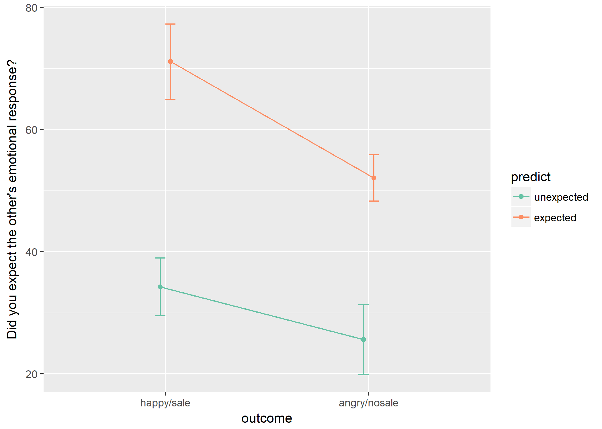
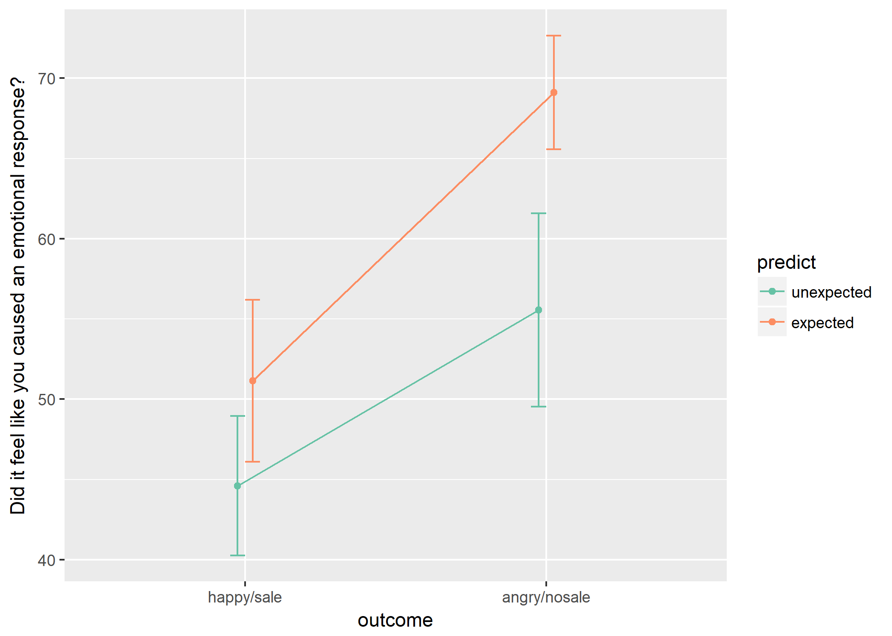
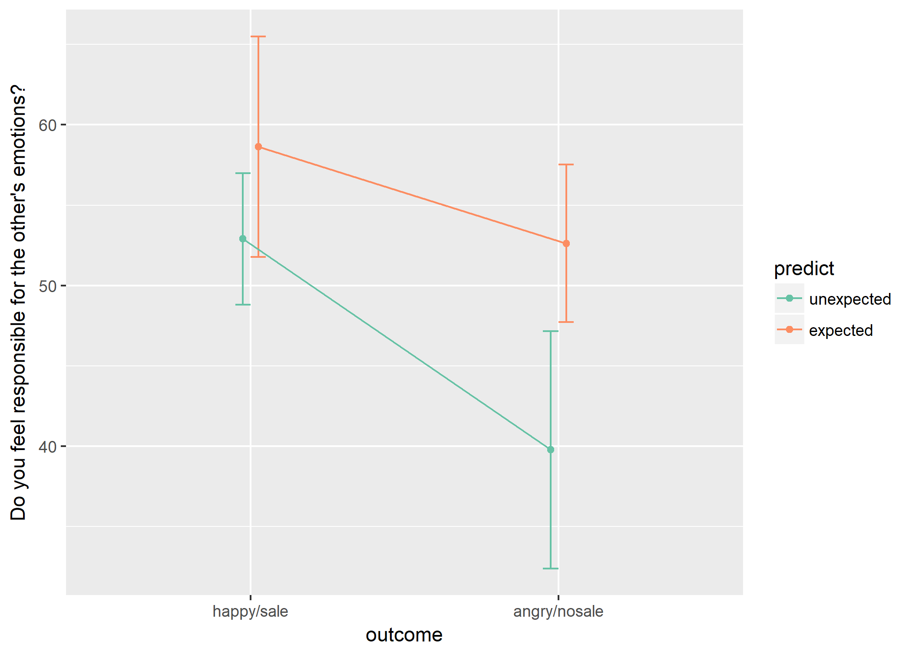
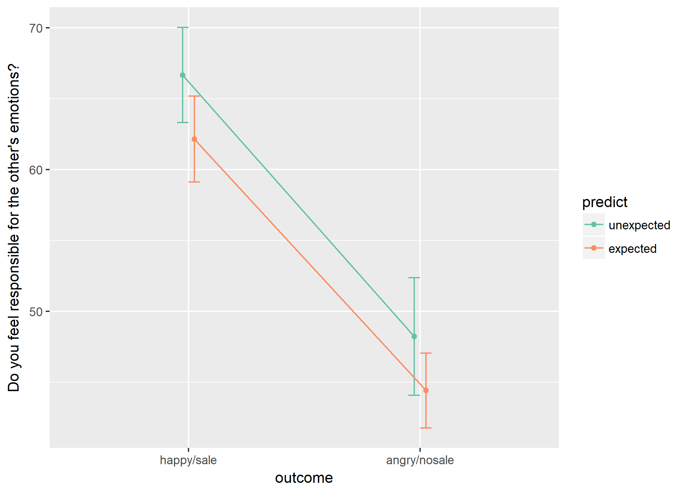

The Many Faces of Agency
================
Daria Kharkina
2018-03-16

Manipulation check
------------------

``` r
flea %>% group_by(predict) %>% summarise(M = mean(prediction_E),
                                         SD = sd(prediction_E)) %>%
  as.data.frame() %>% pandoc.table(round = 3)
```

<table style="width:32%;">
<colgroup>
<col width="15%" />
<col width="8%" />
<col width="8%" />
</colgroup>
<thead>
<tr class="header">
<th align="center">predict</th>
<th align="center">M</th>
<th align="center">SD</th>
</tr>
</thead>
<tbody>
<tr class="odd">
<td align="center">unexpected</td>
<td align="center">31.2</td>
<td align="center">26.38</td>
</tr>
<tr class="even">
<td align="center">expected</td>
<td align="center">57.65</td>
<td align="center">23.77</td>
</tr>
</tbody>
</table>

``` r
flea %>% group_by(outcome) %>% summarise(M = mean(prediction_E),
                                         SD = sd(prediction_E)) %>%
  as.data.frame() %>% pandoc.table(round = 3)
```

<table style="width:35%;">
<colgroup>
<col width="18%" />
<col width="8%" />
<col width="8%" />
</colgroup>
<thead>
<tr class="header">
<th align="center">outcome</th>
<th align="center">M</th>
<th align="center">SD</th>
</tr>
</thead>
<tbody>
<tr class="odd">
<td align="center">happy/sale</td>
<td align="center">45.23</td>
<td align="center">30.97</td>
</tr>
<tr class="even">
<td align="center">angry/nosale</td>
<td align="center">42.92</td>
<td align="center">25.97</td>
</tr>
</tbody>
</table>

``` r
options(contrasts = c('contr.sum','contr.poly'))

etasq(lm(prediction_E ~ predict*outcome, data=flea), anova = T,type="III") %>% pandoc.table(round = 3, missing = "")
```

<table>
<colgroup>
<col width="30%" />
<col width="22%" />
<col width="12%" />
<col width="6%" />
<col width="13%" />
<col width="13%" />
</colgroup>
<thead>
<tr class="header">
<th align="center"> </th>
<th align="center">Partial eta^2</th>
<th align="center">Sum Sq</th>
<th align="center">Df</th>
<th align="center">F value</th>
<th align="center">Pr(&gt;F)</th>
</tr>
</thead>
<tbody>
<tr class="odd">
<td align="center"><strong>(Intercept)</strong></td>
<td align="center">0.759</td>
<td align="center">179540</td>
<td align="center">1</td>
<td align="center">299.9</td>
<td align="center">0</td>
</tr>
<tr class="even">
<td align="center"><strong>predict</strong></td>
<td align="center">0.274</td>
<td align="center">21514</td>
<td align="center">1</td>
<td align="center">35.94</td>
<td align="center">0</td>
</tr>
<tr class="odd">
<td align="center"><strong>outcome</strong></td>
<td align="center">0.067</td>
<td align="center">4106</td>
<td align="center">1</td>
<td align="center">6.858</td>
<td align="center">0.01</td>
</tr>
<tr class="even">
<td align="center"><strong>predict:outcome</strong></td>
<td align="center">0.01</td>
<td align="center">581.9</td>
<td align="center">1</td>
<td align="center">0.972</td>
<td align="center">0.327</td>
</tr>
<tr class="odd">
<td align="center"><strong>Residuals</strong></td>
<td align="center"></td>
<td align="center">56875</td>
<td align="center">95</td>
<td align="center"></td>
<td align="center"></td>
</tr>
</tbody>
</table>

``` r
group_by(flea, outcome, predict) %>% 
  summarise(se = sd(prediction_E)/sqrt(length(prediction_E)),
            sd = sd(prediction_E), prediction_E = mean(prediction_E)) %>%
  ggplot(aes(outcome, prediction_E, color = predict)) + 
  geom_point(position = position_dodge(.1)) +
  geom_errorbar(aes(ymin=prediction_E-se, ymax=prediction_E+se), width=.1,
                position = position_dodge(.1)) +
  scale_color_brewer(palette = "Set2") + 
  geom_line(aes(group = predict), position = position_dodge(.1)) +
  ylab("Did you expect the other's emotional response?")
```



Agency
------

``` r
flea %>% group_by(predict) %>% summarise(M = mean(causat),
                                         SD = sd(causat)) %>%
  as.data.frame() %>% pandoc.table(round = 3)
```

<table style="width:32%;">
<colgroup>
<col width="15%" />
<col width="8%" />
<col width="8%" />
</colgroup>
<thead>
<tr class="header">
<th align="center">predict</th>
<th align="center">M</th>
<th align="center">SD</th>
</tr>
</thead>
<tbody>
<tr class="odd">
<td align="center">unexpected</td>
<td align="center">48.47</td>
<td align="center">25.45</td>
</tr>
<tr class="even">
<td align="center">expected</td>
<td align="center">63.88</td>
<td align="center">21.58</td>
</tr>
</tbody>
</table>

``` r
flea %>% group_by(outcome) %>% summarise(M = mean(causat),
                                         SD = sd(causat)) %>%
  as.data.frame() %>% pandoc.table(round = 3)
```

<table style="width:35%;">
<colgroup>
<col width="18%" />
<col width="8%" />
<col width="8%" />
</colgroup>
<thead>
<tr class="header">
<th align="center">outcome</th>
<th align="center">M</th>
<th align="center">SD</th>
</tr>
</thead>
<tbody>
<tr class="odd">
<td align="center">happy/sale</td>
<td align="center">46.55</td>
<td align="center">23.3</td>
</tr>
<tr class="even">
<td align="center">angry/nosale</td>
<td align="center">64.42</td>
<td align="center">23.13</td>
</tr>
</tbody>
</table>

``` r
etasq(lm(causat ~ predict*outcome, data=flea), anova = T,type=3) %>% pandoc.table(round = 3, missing = "")
```

<table>
<colgroup>
<col width="30%" />
<col width="22%" />
<col width="12%" />
<col width="6%" />
<col width="13%" />
<col width="13%" />
</colgroup>
<thead>
<tr class="header">
<th align="center"> </th>
<th align="center">Partial eta^2</th>
<th align="center">Sum Sq</th>
<th align="center">Df</th>
<th align="center">F value</th>
<th align="center">Pr(&gt;F)</th>
</tr>
</thead>
<tbody>
<tr class="odd">
<td align="center"><strong>(Intercept)</strong></td>
<td align="center">0.84</td>
<td align="center">260237</td>
<td align="center">1</td>
<td align="center">497.7</td>
<td align="center">0</td>
</tr>
<tr class="even">
<td align="center"><strong>predict</strong></td>
<td align="center">0.042</td>
<td align="center">2164</td>
<td align="center">1</td>
<td align="center">4.138</td>
<td align="center">0.045</td>
</tr>
<tr class="odd">
<td align="center"><strong>outcome</strong></td>
<td align="center">0.083</td>
<td align="center">4481</td>
<td align="center">1</td>
<td align="center">8.569</td>
<td align="center">0.004</td>
</tr>
<tr class="even">
<td align="center"><strong>predict:outcome</strong></td>
<td align="center">0.005</td>
<td align="center">264.4</td>
<td align="center">1</td>
<td align="center">0.506</td>
<td align="center">0.479</td>
</tr>
<tr class="odd">
<td align="center"><strong>Residuals</strong></td>
<td align="center"></td>
<td align="center">49678</td>
<td align="center">95</td>
<td align="center"></td>
<td align="center"></td>
</tr>
</tbody>
</table>

``` r
group_by(flea, outcome, predict) %>% 
  summarise(se = sd(causat)/sqrt(length(causat)),
            sd = sd(causat), causat = mean(causat)) %>%
  ggplot(aes(outcome, causat, color = predict)) + 
  geom_point(position = position_dodge(.1)) +
  geom_errorbar(aes(ymin=causat-se, ymax=causat+se), width=.1,
                position = position_dodge(.1)) +
  scale_color_brewer(palette = "Set2") + 
  geom_line(aes(group = predict), position = position_dodge(.1)) +
  ylab("Did it feel like you caused an emotional response?")
```



Responsibility
--------------

``` r
flea %>% group_by(predict) %>% summarise(M = mean(responsibility_E),
                                         SD = sd(responsibility_E)) %>%
  as.data.frame() %>% pandoc.table(round = 3)
```

<table style="width:32%;">
<colgroup>
<col width="15%" />
<col width="8%" />
<col width="8%" />
</colgroup>
<thead>
<tr class="header">
<th align="center">predict</th>
<th align="center">M</th>
<th align="center">SD</th>
</tr>
</thead>
<tbody>
<tr class="odd">
<td align="center">unexpected</td>
<td align="center">48.27</td>
<td align="center">26.97</td>
</tr>
<tr class="even">
<td align="center">expected</td>
<td align="center">54.38</td>
<td align="center">27.61</td>
</tr>
</tbody>
</table>

``` r
flea %>% group_by(outcome) %>% summarise(M = mean(responsibility_E),
                                         SD = sd(responsibility_E)) %>%
  as.data.frame() %>% pandoc.table(round = 3)
```

<table style="width:35%;">
<colgroup>
<col width="18%" />
<col width="8%" />
<col width="8%" />
</colgroup>
<thead>
<tr class="header">
<th align="center">outcome</th>
<th align="center">M</th>
<th align="center">SD</th>
</tr>
</thead>
<tbody>
<tr class="odd">
<td align="center">happy/sale</td>
<td align="center">54.62</td>
<td align="center">24.02</td>
</tr>
<tr class="even">
<td align="center">angry/nosale</td>
<td align="center">48.17</td>
<td align="center">29.89</td>
</tr>
</tbody>
</table>

``` r
etasq(lm(responsibility_E ~ predict*outcome, data=flea), anova = T,type=3) %>% pandoc.table(round = 3, missing = "")
```

<table>
<colgroup>
<col width="30%" />
<col width="22%" />
<col width="12%" />
<col width="6%" />
<col width="13%" />
<col width="13%" />
</colgroup>
<thead>
<tr class="header">
<th align="center"> </th>
<th align="center">Partial eta^2</th>
<th align="center">Sum Sq</th>
<th align="center">Df</th>
<th align="center">F value</th>
<th align="center">Pr(&gt;F)</th>
</tr>
</thead>
<tbody>
<tr class="odd">
<td align="center"><strong>(Intercept)</strong></td>
<td align="center">0.761</td>
<td align="center">222789</td>
<td align="center">1</td>
<td align="center">303</td>
<td align="center">0</td>
</tr>
<tr class="even">
<td align="center"><strong>predict</strong></td>
<td align="center">0.026</td>
<td align="center">1848</td>
<td align="center">1</td>
<td align="center">2.513</td>
<td align="center">0.116</td>
</tr>
<tr class="odd">
<td align="center"><strong>outcome</strong></td>
<td align="center">0.027</td>
<td align="center">1966</td>
<td align="center">1</td>
<td align="center">2.674</td>
<td align="center">0.105</td>
</tr>
<tr class="even">
<td align="center"><strong>predict:outcome</strong></td>
<td align="center">0.004</td>
<td align="center">270.5</td>
<td align="center">1</td>
<td align="center">0.368</td>
<td align="center">0.546</td>
</tr>
<tr class="odd">
<td align="center"><strong>Residuals</strong></td>
<td align="center"></td>
<td align="center">69841</td>
<td align="center">95</td>
<td align="center"></td>
<td align="center"></td>
</tr>
</tbody>
</table>

``` r
group_by(flea, outcome, predict) %>% 
  summarise(se = sd(responsibility_E)/sqrt(length(responsibility_E)),
            sd = sd(responsibility_E), responsibility_E = mean(responsibility_E)) %>%
  ggplot(aes(outcome, responsibility_E, color = predict)) + 
  geom_point(position = position_dodge(.1)) +
  geom_errorbar(aes(ymin=responsibility_E-se, ymax=responsibility_E+se), width=.1,
                position = position_dodge(.1)) +
  scale_color_brewer(palette = "Set2") + 
  geom_line(aes(group = predict), position = position_dodge(.1)) +
  ylab("Do you feel responsible for the other's emotions?")
```



Mood
----

``` r
flea %>% group_by(predict) %>% summarise(M = mean(feeling),
                                         SD = sd(feeling)) %>%
  as.data.frame() %>% pandoc.table(round = 3)
```

<table style="width:32%;">
<colgroup>
<col width="15%" />
<col width="8%" />
<col width="8%" />
</colgroup>
<thead>
<tr class="header">
<th align="center">predict</th>
<th align="center">M</th>
<th align="center">SD</th>
</tr>
</thead>
<tbody>
<tr class="odd">
<td align="center">unexpected</td>
<td align="center">60.16</td>
<td align="center">20.57</td>
</tr>
<tr class="even">
<td align="center">expected</td>
<td align="center">49.58</td>
<td align="center">16.39</td>
</tr>
</tbody>
</table>

``` r
flea %>% group_by(outcome) %>% summarise(M = mean(feeling),
                                         SD = sd(feeling)) %>%
  as.data.frame() %>% pandoc.table(round = 3)
```

<table style="width:35%;">
<colgroup>
<col width="18%" />
<col width="8%" />
<col width="8%" />
</colgroup>
<thead>
<tr class="header">
<th align="center">outcome</th>
<th align="center">M</th>
<th align="center">SD</th>
</tr>
</thead>
<tbody>
<tr class="odd">
<td align="center">happy/sale</td>
<td align="center">65.32</td>
<td align="center">17.33</td>
</tr>
<tr class="even">
<td align="center">angry/nosale</td>
<td align="center">45.73</td>
<td align="center">16.12</td>
</tr>
</tbody>
</table>

``` r
etasq(lm(feeling ~ predict*outcome, data=flea), anova = T,type=3) %>% pandoc.table(round = 3, missing = "")
```

<table>
<colgroup>
<col width="30%" />
<col width="22%" />
<col width="12%" />
<col width="6%" />
<col width="13%" />
<col width="13%" />
</colgroup>
<thead>
<tr class="header">
<th align="center"> </th>
<th align="center">Partial eta^2</th>
<th align="center">Sum Sq</th>
<th align="center">Df</th>
<th align="center">F value</th>
<th align="center">Pr(&gt;F)</th>
</tr>
</thead>
<tbody>
<tr class="odd">
<td align="center"><strong>(Intercept)</strong></td>
<td align="center">0.908</td>
<td align="center">262654</td>
<td align="center">1</td>
<td align="center">934.5</td>
<td align="center">0</td>
</tr>
<tr class="even">
<td align="center"><strong>predict</strong></td>
<td align="center">0.014</td>
<td align="center">372</td>
<td align="center">1</td>
<td align="center">1.324</td>
<td align="center">0.253</td>
</tr>
<tr class="odd">
<td align="center"><strong>outcome</strong></td>
<td align="center">0.208</td>
<td align="center">7010</td>
<td align="center">1</td>
<td align="center">24.94</td>
<td align="center">0</td>
</tr>
<tr class="even">
<td align="center"><strong>predict:outcome</strong></td>
<td align="center">0</td>
<td align="center">2.726</td>
<td align="center">1</td>
<td align="center">0.01</td>
<td align="center">0.922</td>
</tr>
<tr class="odd">
<td align="center"><strong>Residuals</strong></td>
<td align="center"></td>
<td align="center">26700</td>
<td align="center">95</td>
<td align="center"></td>
<td align="center"></td>
</tr>
</tbody>
</table>

``` r
group_by(flea, outcome, predict) %>% 
  summarise(se = sd(feeling)/sqrt(length(feeling)),
            sd = sd(feeling), feeling = mean(feeling)) %>%
  ggplot(aes(outcome, feeling, color = predict)) + 
  geom_point(position = position_dodge(.1)) +
  geom_errorbar(aes(ymin=feeling-se, ymax=feeling+se), width=.1,
                position = position_dodge(.1)) +
  scale_color_brewer(palette = "Set2") + 
  geom_line(aes(group = predict), position = position_dodge(.1)) +
  ylab("Do you feel responsible for the other's emotions?")
```



Buying behavior
---------------

``` r
flea %>% group_by(predict) %>% summarise(M = mean(buy),
                                         SD = sd(buy)) %>%
  as.data.frame() %>% pandoc.table(round = 3)
```

<table style="width:32%;">
<colgroup>
<col width="15%" />
<col width="8%" />
<col width="8%" />
</colgroup>
<thead>
<tr class="header">
<th align="center">predict</th>
<th align="center">M</th>
<th align="center">SD</th>
</tr>
</thead>
<tbody>
<tr class="odd">
<td align="center">unexpected</td>
<td align="center">59.16</td>
<td align="center">34.42</td>
</tr>
<tr class="even">
<td align="center">expected</td>
<td align="center">39.4</td>
<td align="center">24.1</td>
</tr>
</tbody>
</table>

``` r
flea %>% group_by(outcome) %>% summarise(M = mean(buy),
                                         SD = sd(buy)) %>%
  as.data.frame() %>% pandoc.table(round = 3)
```

<table style="width:35%;">
<colgroup>
<col width="18%" />
<col width="8%" />
<col width="8%" />
</colgroup>
<thead>
<tr class="header">
<th align="center">outcome</th>
<th align="center">M</th>
<th align="center">SD</th>
</tr>
</thead>
<tbody>
<tr class="odd">
<td align="center">happy/sale</td>
<td align="center">73.04</td>
<td align="center">20.62</td>
</tr>
<tr class="even">
<td align="center">angry/nosale</td>
<td align="center">28.36</td>
<td align="center">23.15</td>
</tr>
</tbody>
</table>

``` r
etasq(lm(buy ~ predict*outcome, data=flea), anova = T,type=3) %>% pandoc.table(round = 3, missing = "")
```

<table>
<colgroup>
<col width="30%" />
<col width="22%" />
<col width="12%" />
<col width="6%" />
<col width="13%" />
<col width="13%" />
</colgroup>
<thead>
<tr class="header">
<th align="center"> </th>
<th align="center">Partial eta^2</th>
<th align="center">Sum Sq</th>
<th align="center">Df</th>
<th align="center">F value</th>
<th align="center">Pr(&gt;F)</th>
</tr>
</thead>
<tbody>
<tr class="odd">
<td align="center"><strong>(Intercept)</strong></td>
<td align="center">0.824</td>
<td align="center">198353</td>
<td align="center">1</td>
<td align="center">444.5</td>
<td align="center">0</td>
</tr>
<tr class="even">
<td align="center"><strong>predict</strong></td>
<td align="center">0.016</td>
<td align="center">692.5</td>
<td align="center">1</td>
<td align="center">1.552</td>
<td align="center">0.216</td>
</tr>
<tr class="odd">
<td align="center"><strong>outcome</strong></td>
<td align="center">0.471</td>
<td align="center">37770</td>
<td align="center">1</td>
<td align="center">84.64</td>
<td align="center">0</td>
</tr>
<tr class="even">
<td align="center"><strong>predict:outcome</strong></td>
<td align="center">0.088</td>
<td align="center">4084</td>
<td align="center">1</td>
<td align="center">9.151</td>
<td align="center">0.003</td>
</tr>
<tr class="odd">
<td align="center"><strong>Residuals</strong></td>
<td align="center"></td>
<td align="center">42393</td>
<td align="center">95</td>
<td align="center"></td>
<td align="center"></td>
</tr>
</tbody>
</table>

``` r
group_by(flea, outcome, predict) %>% 
  summarise(se = sd(buy)/sqrt(length(buy)),
            sd = sd(buy), buy = mean(buy)) %>%
  ggplot(aes(outcome, buy, color = predict)) + 
  geom_point(position = position_dodge(.1)) +
  geom_errorbar(aes(ymin=buy-se, ymax=buy+se), width=.1,
                position = position_dodge(.1)) +
  scale_color_brewer(palette = "Set2") + 
  geom_line(aes(group = predict), position = position_dodge(.1)) +
  ylab("Do you buy again from this person?")
```


